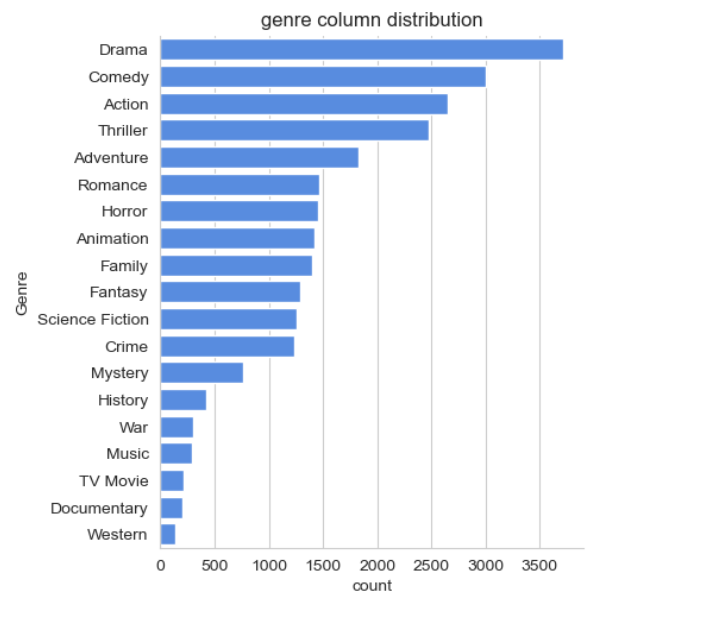
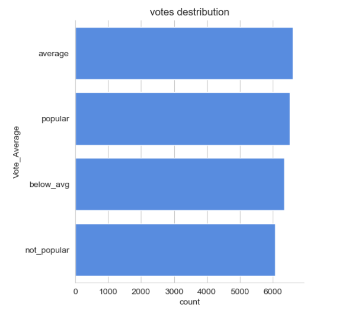

# Netflix Movie Data Analysis

This project focuses on analyzing Netflix movie data using Python and Data Analytics techniques.  
The analysis was performed on a dataset containing more than 9,800 movies to discover useful insights and trends.

---

# Project Objectives

The main objectives of this project are:

- Find the most frequent movie genres on Netflix
- Identify movies with the highest vote average
- Analyze movie popularity
- Discover the highest and lowest popular movies
- Find which year had the highest number of movie releases

---

# Technologies Used

- Python
- Pandas
- NumPy
- Matplotlib
- Seaborn
- Jupyter Notebook

---

# Dataset Information

The dataset contains:

- 9827 rows
- 9 columns

The dataset was cleaned and prepared before analysis by:

- Removing unnecessary columns
- Converting Release_Date into datetime format
- Extracting only the year from the date
- Cleaning genre values
- Categorizing the Vote_Average column
- Handling string formatting issues

---

# Project Structure

```bash
NETFLIX-MOVIE-ANALYSIS
│
├── data/
│   └── mymoviedb.csv
│
├── images/
│   ├── genre_column_distribution.png
│   └── genre_with_highest_votes.png
│
├── notebooks/
│   └── netflix_movie_analysis.ipynb
│
├── presentations/
│   ├── project_overview.pptx
│   └── netflix_analysis_solution.pptx
│
├── README.md
├── requirements.txt
└── .gitignore
```

---

# Exploratory Data Analysis

During the analysis, the following tasks were performed:

- Checked dataset shape and information
- Verified missing and duplicate values
- Converted date columns into proper datetime format
- Cleaned and formatted genre data
- Categorized vote average values
- Created visualizations for better understanding

---

# Visualizations

## Genre Distribution



---

## Genre With Highest Votes



---

# Key Insights

- Drama and Action were among the most common genres
- Some movies achieved extremely high popularity scores
- Movie releases increased significantly after 2015
- Categorizing vote averages improved visualization and analysis
- The dataset was already clean with no missing or duplicate values

---

# Future Improvements

- Build an interactive dashboard using Streamlit
- Add more advanced visualizations
- Create a movie recommendation system
- Deploy the project online

---

# Repository Description

Netflix Movie Data Analysis using Python, Pandas, Matplotlib and Seaborn

---

# Author

Anu Gaur
